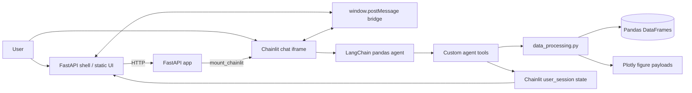

# CSV Agent Explorer

CSV Agent Explorer is an agent-driven web application for cleaning, preprocessing, browsing, and visualizing CSV files with a split-screen interface:

- **Left pane**: interactive data workspace for table browsing and Plotly charts
- **Right pane**: **Chainlit** chat UI backed by a LangChain pandas dataframe agent

The application supports **up to five CSV files per session**, file targeting with `@filename` syntax, backend-managed workspace context for conversational continuity, paginated table browsing, Plotly visualizations, and agent-triggered dataframe preprocessing that immediately updates the UI.

## Core capabilities

- Upload and register up to **5 CSV files** in one session
- Reference a specific file in chat with:
  - `@alias`
  - `@filename`
  - `@"Full File Name.csv"`
- Auto-clean uploaded CSVs:
  - normalize column names
  - drop empty rows/columns
  - infer booleans, numerics, and datetimes
  - drop duplicate rows
- Interactively browse every registered file in the table workspace
- Paginate large tables with page sizes of **25 / 50 / 100** rows
- Create Plotly charts through chat prompts
- Run dataframe preprocessing from natural-language requests and immediately surface new columns in the table view
- Preserve left-pane continuity in the agent through backend `workspace_context`

---

## Architecture

### High-level design



### Runtime components

#### 1. FastAPI host application
File: `main.py`

Responsibilities:
- serves the outer web shell
- serves static assets under `/static`
- mounts the Chainlit app at `/chainlit`
- keeps the split-screen layout under a single origin

#### 2. Chainlit application
File: `cl_app.py`

Responsibilities:
- receives uploads through Chainlit
- manages multi-file session state
- builds the LangChain dataframe agent
- exposes custom agent tools
- syncs left-pane UI state through window messages
- stores backend-only workspace context for conversational continuity

#### 3. Data processing layer
File: `data_processing.py`

Responsibilities:
- CSV loading
- dataframe cleaning and type inference
- summary generation
- paginated table payload generation
- Plotly payload generation
- safe evaluation of preprocessing expressions

#### 4. Frontend workspace
Files:
- `static/index.html`
- `static/app.js`
- `static/styles.css`
- `static/vendor/plotly.min.js`

Responsibilities:
- two-pane shell layout
- file registry / file switching / deletion
- paginated table rendering
- Plotly chart rendering
- resizable center divider
- message bridge with embedded Chainlit iframe

---

## Session state model

The application keeps its working state in `cl.user_session`.

### Main session objects

- `datasets`: dictionary of registered CSV records
- `dataset_order`: ordered list of dataset keys for UI display
- `active_dataset_key`: currently selected file in the workspace
- `ui_state`: current table/chart/summary payload pushed to the frontend
- `workspace_context`: backend-only context injected into each agent request

### Dataset record structure

Each registered CSV stores a record similar to:

```python
{
  "name": "Sales Q1.csv",
  "mention": "sales_q1",
  "aliases": [...],
  "df": <cleaned pandas.DataFrame>,
  "summary": {...},
  "chart": {...} | None,
  "table_state": {
    "page_size": 25,
    "page": 1,
    "focus_columns": []
  },
  "transformation_history": [...],
  "agent": <LangChain dataframe agent>
}
```

---

## Request flow

### CSV upload flow

1. User uploads one or more CSV files in Chainlit
2. `cl_app.py` loads each file with `load_csv()`
3. `clean_dataframe()` standardizes columns and types
4. A dataset record is created and stored in session state
5. The newest file becomes active
6. `sync_ui()` sends updated `ui_state` to the frontend

### Chat analysis flow

1. User enters a prompt in Chainlit
2. The app resolves any `@filename` references
3. The active or referenced dataset is selected
4. Backend `workspace_context` is added to the agent request
5. LangChain runs the pandas agent with custom tools
6. Tool calls update table/chart state
7. `sync_ui()` pushes the refreshed left-pane state to the browser

### Frontend interaction flow

The frontend can send these events back to Chainlit:

- `SYNC_VIEW`
- `ACTIVE_VIEW_CHANGED`
- `ACTIVE_DATASET_CHANGED`
- `DELETE_DATASET`
- `REQUEST_UPLOAD_FILES`
- `TABLE_PAGE_CHANGED`
- `TABLE_PAGE_SIZE_CHANGED`

This keeps the left-pane workspace and the chat agent synchronized.

---

## Agent architecture

The agent is created with:

- **LangChain experimental** `create_pandas_dataframe_agent`
- a **single selected dataframe** named `df` for each request
- a **ChatOpenAI** model (`OPENAI_MODEL`, default `gpt-4o-mini`)
- `agent_type="tool-calling"`
- `allow_dangerous_code=True`

### Why one dataframe per request?

Even though the application supports multiple files, each individual agent invocation is scoped to **one selected dataframe**. This keeps the pandas-agent interaction predictable and makes `@filename` routing explicit.

If a prompt mentions multiple files, the app currently selects the **first referenced file** for tool-driven operations and records that choice in the prompt context.

---

## Agent tools

The custom tools are defined in `cl_app.py` and exposed to the pandas agent in addition to the dataframe itself.

### 1. `show_cleaned_table`

Purpose:
- switch the left pane to the paginated table view for the selected dataset
- optionally change the rows-per-page setting

Signature:

```python
show_cleaned_table(rows: Optional[int] = None) -> str
```

Behavior:
- updates the selected dataset's `table_state`
- resets the page to `1`
- preserves current `focus_columns`
- syncs the UI and reports the visible row window

### 2. `render_plot`

Purpose:
- render a Plotly chart in the left pane

Schema:

```python
chart_type: Literal["bar", "line", "scatter", "histogram", "box", "pie"]
x: str
y: Optional[str] = None
color: Optional[str] = None
aggregation: Optional[Literal["sum", "mean", "count", "median", "min", "max"]] = None
top_n: Optional[int] = None
sort_desc: bool = True
title: Optional[str] = None
```

Behavior:
- builds a chart payload with `build_plot_payload()`
- stores the serialized Plotly figure on the selected dataset
- switches the workspace to chart view
- syncs the UI

### 3. `preprocess_dataframe`

Purpose:
- create or update one or more dataframe columns before further analysis or plotting

Schema:

```python
target_column: list[str]
expression: str
preview_rows: Optional[int] = None
```

Behavior:
- evaluates the preprocessing expression safely
- supports **single-column** and **multi-column** outputs
- writes results back into the dataframe
- records transformation history
- refreshes the summary payload
- clears any existing chart
- sets the new derived columns as `focus_columns`
- rebuilds the dataframe agent against the updated dataframe
- syncs the UI so the new columns are visible immediately

### Examples

Single derived column:

```text
compute the difference between out_tpd and out_tpd2 and create tpd_delta
```

Typical tool call:

```python
preprocess_dataframe(
    target_column=["tpd_delta"],
    expression="round(out_tpd - out_tpd2, 3)"
)
```

Multi-column derived output:

```text
out_ln·out_lp(미터)를 나노미터(nm) 로 변환해 ln_nm, lp_nm 컬럼을 생성
```

Typical tool call:

```python
preprocess_dataframe(
    target_column=["ln_nm", "lp_nm"],
    expression="(out_ln * 1e9, out_lp * 1e9)"
)
```

---

## Safe preprocessing evaluator

Preprocessing expressions are evaluated through a constrained AST-based evaluator in `data_processing.py`.

Supported categories include:
- arithmetic
- comparisons
- boolean expressions
- scalar constants
- selected math helpers such as:
  - `round`
  - `abs`
  - `sqrt`
  - `log`
  - `log10`
  - `log1p`
  - `exp`
  - `floor`
  - `ceil`
  - `clip`
- pandas string accessor slicing such as:
  - `corner_tag.str[:2]`
  - `corner_tag.str[-2:]`
  - `corner_tag.str[1]`

This evaluator is designed to support feature engineering workflows while avoiding unrestricted arbitrary Python execution in preprocessing expressions.

---

## Data cleaning pipeline

When a CSV is uploaded, the application performs these steps:

1. Load CSV with tolerant encoding / delimiter attempts
2. Normalize column names to snake_case-like identifiers
3. Standardize common missing-value tokens
4. Drop fully empty rows
5. Drop fully empty columns
6. Infer booleans, numerics, and datetimes where confidence is high enough
7. Drop duplicate rows
8. Build a summary payload for UI display

The resulting cleaned dataframe becomes the basis for all agent operations.

---

## UI / UX design notes

### Split-screen shell

- **Left pane**: workspace
- **Right pane**: Chainlit chat
- center divider is draggable

### Table workspace

- paginated browsing
- sticky row numbers
- sticky header
- horizontal scrolling for wide tables
- wrap-cells toggle
- compact-rows toggle
- focus/highlight columns surfaced after preprocessing

### File management

- file strip at the top of the workspace
- active-file switching without leaving the table view
- delete action for registered files
- upload CTA until the five-file limit is reached

### Chart workspace

- Plotly figure rendering
- summary panel hidden during chart display for more usable chart space

---

## Project structure

```text
csv_agent_app/
├── .chainlit/
│   └── config.toml
├── cl_app.py
├── data_processing.py
├── main.py
├── static/
│   ├── app.js
│   ├── index.html
│   ├── styles.css
│   └── vendor/
│       └── plotly.min.js
└── README.md
```

---

## Local setup

### 1. Install dependencies

```bash
pip install -r requirements.txt
```

### 2. Set environment variables

Create a `.env` file or export environment variables:

```bash
OPENAI_API_KEY=your_key_here
OPENAI_MODEL=gpt-4o-mini
```

### 3. Start the app

```bash
uvicorn main:app --host 0.0.0.0 --port 8000
```

Open:

```text
http://localhost:8000
```

---

## Notes and limitations

- The pandas agent is allowed to execute dataframe-oriented code through LangChain's pandas-agent machinery.
- Preprocessing expressions are handled separately through a restricted evaluator.
- Tool-driven analysis is scoped to one selected dataframe per request.
- The current multi-file routing model is optimized for `@filename`-based selection rather than cross-dataframe joins.

---

## Suggested next enhancements

- direct page-number jump input
- side-by-side cross-file comparison workflows
- explicit join / merge tools across referenced CSVs
- persistent upload storage beyond one chat session
- downloadable transformed CSV exports per active file
